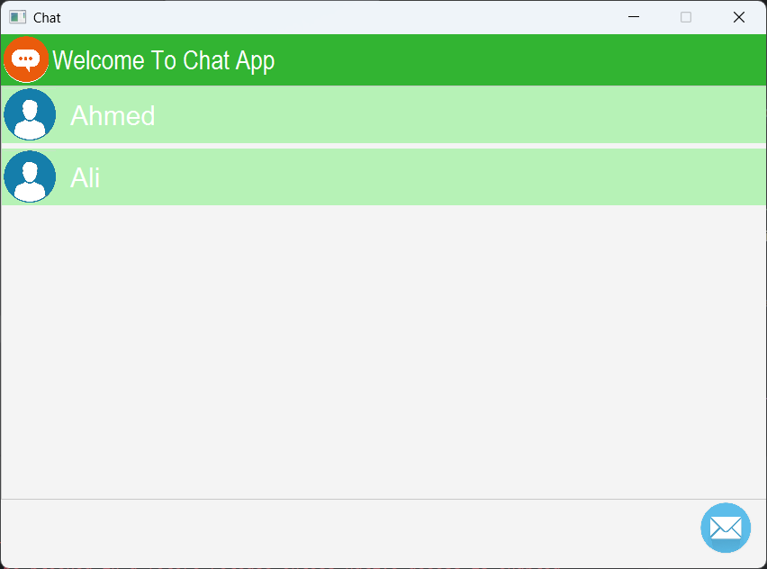
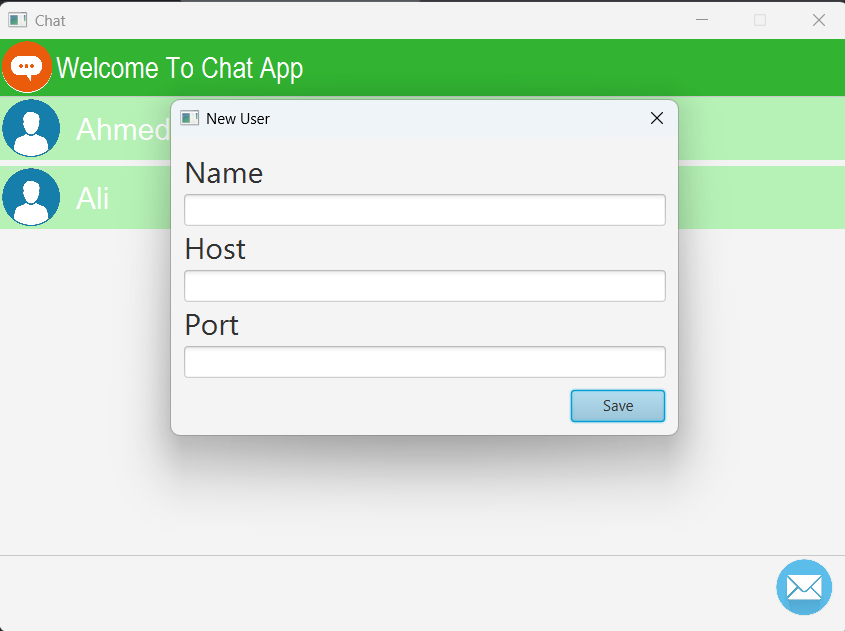
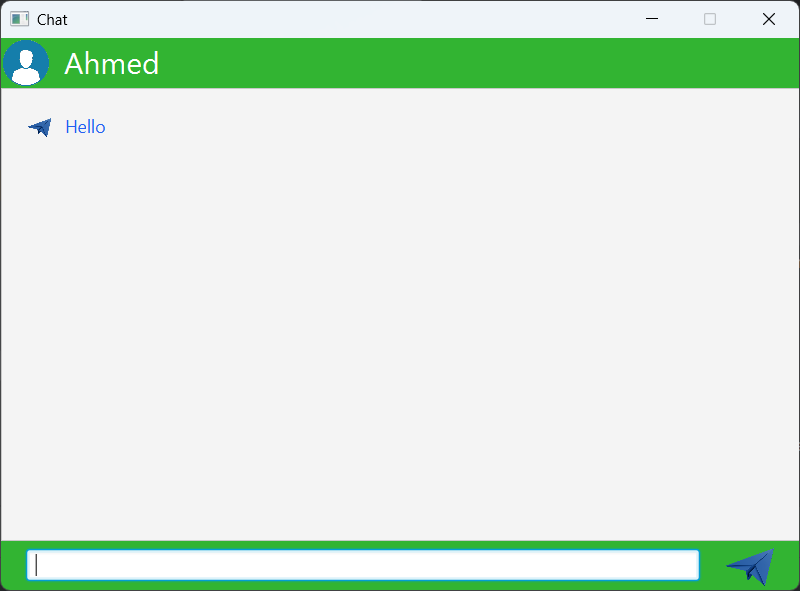

# Chat App

Chat App is a simple chat application built using JavaFX. It is a simple application that allows you to chat with other users on the same network.

## Features:
- Create a new user
- List all users
- Send messages to other users
- Receive messages from other users
- Connect to other users on the same network

## Screenshots

